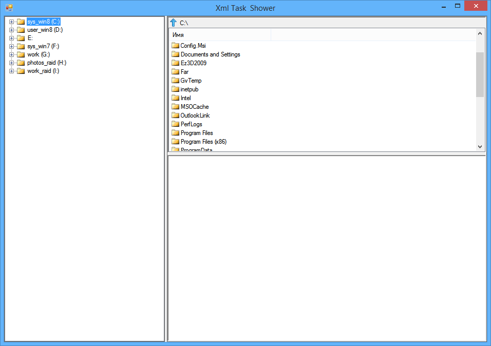

**Описание:** разработать простой вьюер xml-файлов с заданной схемой.

**Требования к разработке:**
* использовать  MS VC#;
* тип приложения – SDI;
* для показа html-контента использовать любой подходящий компонент
* окно должно содержать три фрейма:
  * левый фрейм – содержит дерево со структурой директорий (как в Windows Explorer);
  * правый-верхний фрейм – содержит файлы и поддиректории, находящиеся в директории, выбранной в левом фрейме;
  * правый-нижний фрейм – показывает содержимое xml-документа, выбранное в правом-верхнем фрейме;
  * Отображение содержимого xml-документа – визуально должна быть отображена иерархия текстов, отображается только содержимое тэга "RichText";
  * В тэге RichText - xhtml, в [CDATA[]], при этом xhtml может быть невалидным (ограничимся случаем неправильной балансировки открывающих и закрывающих тэгов);
  * Невалидные тексты из RichText должны быть визуально выделены.


1. Для обработки xml должно быть применено XSLT.
1. Дополнительно: продумайте и по возможности  реализуйте локальную «подсветку» (выделение, указатель и т.п.) конкретных аномалий в невалидном xhtml.
1. Файлы схемы и примера данных прилагаются.

**schema.xsd**
```XML
<?xml version="1.0" encoding="UTF-8" standalone="no"?>
<xsd:schema targetNamespace="http:/consultant.ru/nris/test" xmlns:my="http:/consultant.ru/nris/test" xmlns:xsd="http://www.w3.org/2001/XMLSchema">
	<xsd:attribute name="attrib1" type="xsd:string"/>
	<xsd:element name="Data">
		<xsd:complexType>
			<xsd:sequence>
				<xsd:element ref="my:attrib2" minOccurs="0"/>
				<xsd:element ref="my:Entity" minOccurs="0"/>
				<xsd:element ref="my:Group1" minOccurs="0"/>
				<xsd:element ref="my:Group2" minOccurs="0"/>
			</xsd:sequence>
			<xsd:attribute ref="my:attrib1"/>
			<xsd:anyAttribute processContents="lax" namespace="http://www.w3.org/XML/1998/namespace"/>
		</xsd:complexType>
	</xsd:element>
	<xsd:element name="attrib2" nillable="true" type="xsd:date"/>
	<xsd:element name="Entity">
		<xsd:complexType>
			<xsd:sequence>
				<xsd:element ref="my:RichText" minOccurs="0" maxOccurs="unbounded"/>
				<xsd:element ref="my:Entity" minOccurs="0" maxOccurs="unbounded"/>
			</xsd:sequence>
		</xsd:complexType>
	</xsd:element>
	<xsd:element name="RichText">
		<xsd:complexType mixed="true">
			<xsd:sequence>
				<xsd:any minOccurs="0" maxOccurs="unbounded" namespace="http://www.w3.org/1999/xhtml" processContents="lax"/>
			</xsd:sequence>
		</xsd:complexType>
	</xsd:element>
	<xsd:element name="Group1">
		<xsd:complexType>
			<xsd:sequence>
				<xsd:element ref="my:Entity" minOccurs="0" maxOccurs="unbounded"/>
			</xsd:sequence>
		</xsd:complexType>
	</xsd:element>
	<xsd:element name="Group2">
		<xsd:complexType>
			<xsd:sequence>
				<xsd:element ref="my:Entity" minOccurs="0" maxOccurs="unbounded"/>
			</xsd:sequence>
		</xsd:complexType>
	</xsd:element>
</xsd:schema>
```

**Sample data**
```XML
<my:Data my:attrib1="" xmlns:my="http:/consultant.ru/nris/test">
	<my:attrib2/>
	<my:Entity>
		<my:RichText/>
		<my:Entity>
			<my:RichText/>
		</my:Entity>
	</my:Entity>
	<my:Group1>
		<my:Entity>
			<my:RichText/>
			<my:Entity>
				<my:RichText/>
				<my:Entity>
					<my:RichText/>
				</my:Entity>
			</my:Entity>
		</my:Entity>
	</my:Group1>
	<my:Group2>
		<my:Entity>
			<my:RichText/>
			<my:Entity>
				<my:RichText/>
			</my:Entity>
		</my:Entity>
	</my:Group2>
</my:Data>
```

**Simple Explorer**
